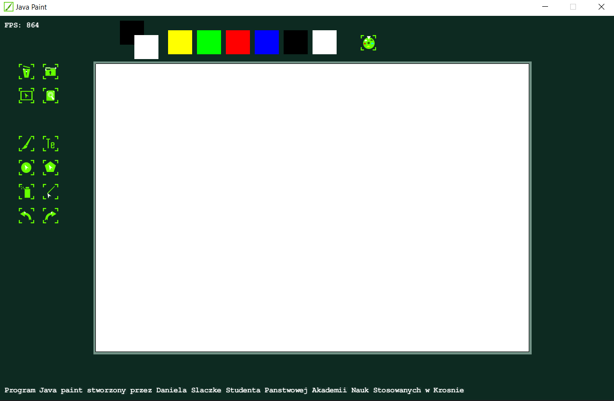

## JavaPaint Program

JavaPaint is a simple program written in Java using the Slick2D graphics library for the User Interface.

### Technologies Used:

* Java 17-19 (It is best to use newer versions of Java as older versions may not support some methods in the code.)
* Slick2D Library Documentation:
  <a href="https://slick.ninjacave.com/javadoc/">https://slick.ninjacave.com/javadoc/</a>

### Program Features:

<ul>
  <li>Create a new canvas: Allows you to start with a blank canvas for your drawings.</li>
  <li>Load images: Import existing images to work on or edit them within the program.</li>
  <li>Draw rectangles: Create shapes with straight lines and right angles.</li>
  <li>Draw polygons: Create shapes with multiple sides and angles.</li>
  <li>Draw ellipses: Create oval or circular shapes.</li>
  <li>Use a brush: Freely draw on the canvas with various brush sizes and styles.</li>
  <li>Draw lines: Create straight lines of varying thickness.</li>
  <li>Use the spray tool: Apply paint in a spray-like pattern on the canvas.</li>
  <li>Undo changes: Reverse the last action performed on the canvas.</li>
  <li>Redo changes: Restore the last undone action on the canvas.</li>
  <li>Generate random colors: Randomly select a new color for drawing.</li>
  <li>Choose fill and border colors: Select specific colors for the interior and outline of shapes.</li>
</ul>

### Image

